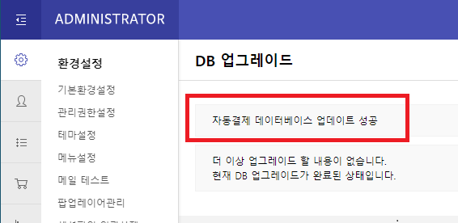
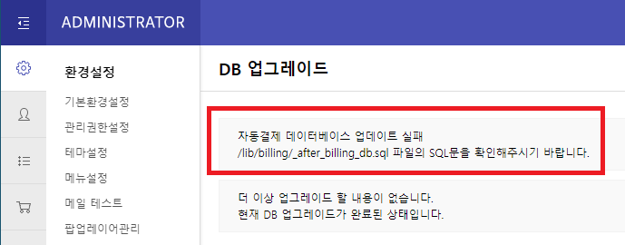
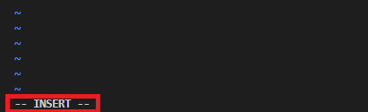
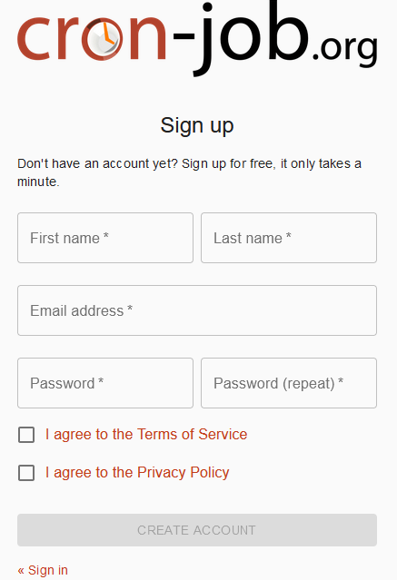
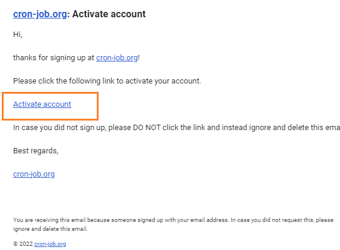
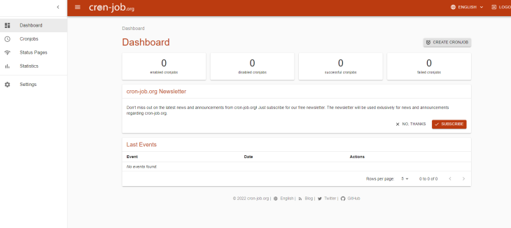
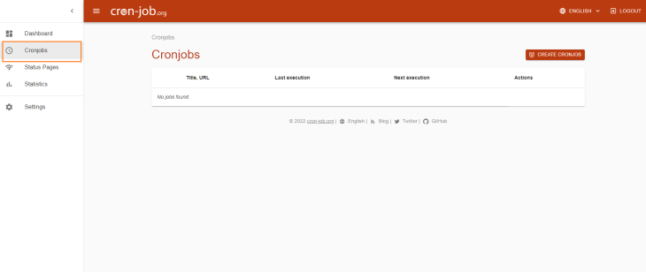
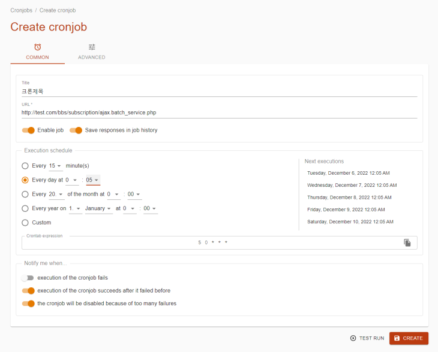
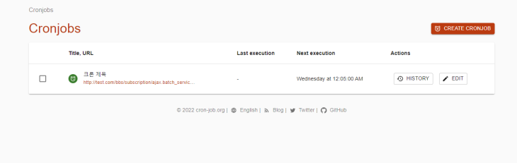

# **그누보드 자동결제(빌링)**

## **요구사항**

<br>

## **설치**

### **1. 소스코드**
1. 압축파일 다운로드 후 압축 해제
2. 설치할 서버에 업로드합니다.
3. **🛠️`bbs/board.php` 파일에 `run_event('header_board');` 를 추가합니다.** (18 Line)
   ```php
        if (!$bo_table) {
            $msg = "bo_table 값이 넘어오지 않았습니다.\\n\\nboard.php?bo_table=code 와 같은 방식으로 넘겨 주세요.";
            alert($msg);
        }
        // 게시판 진입 시 권한을 체크하기 위한 Hook 추가 
        run_event('header_board');

        $g5['board_title'] = ((G5_IS_MOBILE && $board['bo_mobile_subject']) ? $board['bo_mobile_subject'] : $board['bo_subject']);
   ```

### **2. 데이터베이스**
1. 관리자페이지 > 좌측메뉴 > 환경설정의 **'DB업그레이드'** 메뉴를 클릭합니다.
2. DB업그레이드와 함께 자동결제 업데이트도 추가로 진행됩니다.
3. 기존 문구 상단에 '자동결제 데이터베이스 업데이트' 실행결과 문구가 추가된 것을 확인하실 수 있습니다.

업데이트 성공
<br>

<br>
업데이트 실패
<br>



<br>

## **자동결제 실행방법**

- 자동결제를 실행하기 위해서는 매일 정해진 시간에 맞춰서 프로그램이 실행되어야 합니다.
- 아래 3가지 방법 중 상황에 맞는 방법을 적용해야 정상적으로 솔루션을 이용할 수 있습니다.


### **1. linux crontab**
- 리눅스 서버에 접속이 가능해서 crontab 설정을 직접 할 수 있을 때의 방법입니다.

#### **사용방법**

**1. 아래 명령어를 입력, 새 crontab 파일을 만들거나 기존 파일을 편집합니다.**
```bash
crontab -e
```

**2. i를 눌러 파일을 편집 가능한 상태로 만듭니다.**
<br>



**3. 주기적으로 실행할 시간을 입력합니다.**
```vim
# crontab의 구조는 다음과 같습니다.
# 순서대로 {분} {시} {일} {월} {요일} {실행 명령}
# * * * * * {실행 명령}

# 매일 실행되야 하므로 {분}, {시}, {실행 명령}만 수정합니다.
# Ex) 매일 01시 30분에 /bbs/subscription/batch_service.php 경로의 파일을 실행
30 1 * * * /bbs/subscription/batch_service.php
```

**4. esc키를 누른 이후 아래 명령어를 입력해서 저장합니다.**
```vim
:wq
```

**5. crontab이 정상적으로 실행되는지 관리자페이지에서 확인합니다.**

<br>

### **2. cron job (https://console.cron-job.org)**
- 웹호스팅 환경이거나 크론탭을 사용할 수 없는 경우, 온라인으로 크론탭을 서비스해주는 사이트를 이용합니다. 외부 사이트를 사용하는 것이기 때문에 주기적으로  정상적으로 동작하는지 확인이 필요합니다.

#### **사용방법**

**1. 회원가입을 진행합니다. (https://console.cron-job.org/signup)**

**1.1 이름/이메일/비밀번호를 입력, 동의 후 'CREATE ACCOUNT'을 클릭합니다.**
<br>


**1.2 입력한 이메일로 인증메일이 발송됩니다. 'Activate account'을 클릭해서 인증합니다.**
<br>


**2. 다시 [홈페이지](https://console.cron-job.org)에 접속해서 로그인하면 메인화면을 볼 수 있습니다.**
<br>


**3. '좌측 메뉴 > Cronjobs' 클릭, Cron을 등록/확인 할 수 있는 화면으로 접속합니다.**
<br>


**4. '우측 상단 > CREATE CRONJOB' 버튼 클릭**

**5. Title(제목), URL을 입력합니다.**
```
# URL에는 {사이트URL}/bbs/subscription/ajax.batch_service.php 을 입력합니다.
# http:// 또는 https:// 까지 붙여서 넣어주셔야 합니다.
```

**6. Save responses in job history 버튼을 눌러 주황색으로 활성화합니다.**
```
# Cron이 실행된 기록을 남기는 옵션입니다.
```

**7. 'Every day at'에서 실행될 시간을 설정합니다.**
```
# 자동결제는 매일 일정한 시간에 실행되어야 합니다.
# 결제가 실행되기 전까지 사용자는 서비스를 이용할 수 없으므로, 사용자가 적은 00:00 ~ 02:00사이로 설정하시길 권장합니다.
```

**8. 우측 하단의 'CREATE' 버튼을 클릭해서 저장합니다.**
<br>


**9. crontab이 정상적으로 등록되었습니다.**
<br>


<br>

### **3. 관리자페이지 실행**
- 자동결제 실행 파일을 직접 실행할 수 있는 방법입니다.
  
#### **사용방법**

**1. 관리자페이지 > 좌측메뉴 > 정기결제 관리 > 자동결제 실행기록에 접속합니다.**

**2. 우측 상단의 '결제 크론 수동실행' 버튼을 클릭합니다.**

**3. 목록에서 실행결과를 확인합니다.**


### 참고 사항 ###
* KCP 결제 성공코드는 문자열 '0000'
* 스킨에서는 /bbs/subscription/subscription_service 서비스의 함수들을 호출하여 사용자가 요구하는 데이터를 입출력합니다.
* MVC 구조입니다 
* M lib/bbs 의 테이블 모델 클래스, bbs/subscription/subscription_service.php 구독 서비스
* V: 스킨 , 테마폴더/subscription/이하 스킨파일
* C ajax, bbs/subscirption/mypage.php , bbs/subscription/view.php : 서비스 컨트롤러
* 기타 kcp 결제 요청 bbs/kcp-batch/이하 파일

### DB 테이블 ###
* billing_cancel 결제 취소이력
* billing_history 결제 이력
* billing_info 현재 결제 상태
* billing_key_history 빌링키(결제키) 발급이력
* billing_schedule 결제 스케쥴 실행이력
* billing_service 결제 서비스정보
* billing_service_price 결제 서비스별 가격정보 변동사항 기록
* billing_config 결제플러그인 설정정보 및 설정변경 이력(site_cd, kcp 그룹 id 등)

### api ###
* 공통응답 에러시
  * http 상태코드 400
  * PG 사 서버에러, 연결 불가 할 때 400이 외의 코드를 출력할 수도 있음.
  * json
  * {"result_message":"에러메시지"
     "result_code":"에러코드"
    }

  * 개별사항 api 에 따라 성공시 데이터만 출력

* POST bbs/kcp-batch/ajax.get_billing_key
  * 빌링키 발급후 리턴 
  * 필수 파라미터
  * tran_cd
  * enc_data
  * enc_info
  * od_id 
  * card_mask_no  결제폼에서 batch_cardno_return_yn 설정시 카드번호 리턴여부
  * 필수파라미터 없을 때 http 상태코드 400

* POST bbs/kcp-batch/ajax.set_billing_info
  * 구독상품 정보 및 빌링키 발급받을때 필요한 데이터 수신 (폼으로 헤도 되지만 ajax 환경이 필요하면 사용)
  * 필수 파라미터
  * od_id
  * service_id

* POST bbs/kcp-batch/ajax.order_billing 
  * 구독 상품 결제 처리
  * 발급된 빌링키를 가지고 pg 사에 결제 요청, billing_information 에 결제 정보저장, billing_history 에 결제이력 저장
  * 필수 파라미터
  * od_id
  * service_id
  * billing_key
  * currency (통화단위 원화)
  * 필수파라미터 없을 때 http 상태코드 400

* POST bbs/kcp-batch/ajax.payment_scheduler
  * 스케쥴러 실행 api

* POST bbs/kcp-batch/ajax.trade_register
  * 모바일 거래등록 (가격이 결정된 이후에 거래등록해야 됩니다.)
  * 필수 파라미터
  * od_id
  * service_id
  * currency (통화단위 원화)

* GET bbs/subscription/ajax.mypage
  * 마이페이지
  * 필수 파라미터
  * w work_mode 

  * w 값에 따라 다릅니다.
  * w: all : 사용자가 구독중인 상품을 조회 
  * w: id : 사용자가 구독중인 상품 한건의 기록을 조회

* POST bbs/subscription/ajax.mypage
  * w: cancel : 사용자가 구독중인 상품을 취소
  